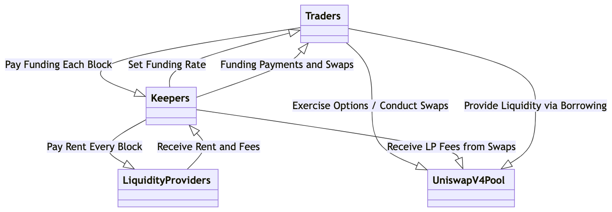

# UniLaas: Liquidity-as-a-Service Uniswap V4 Hook

## Overview

**UniLaas** is a decentralized, permissionless perpetual options trading contract built on Uniswap V4. It combines auction-based pricing mechanisms with perpetual options to allow traders to speculate on price movements of assets, such as ETH, without expiration dates and while employing leverage. This document serves as a guide to understanding the functionality and architecture of the UniLaas contract.




---

## Key Features

1. **Infinite Expiry**:
   - Unlike standard options, perpetual options don’t expire, allowing traders to hold and exercise them at any future time.

2. **Funding Model**:
   - Traders with positions must pay a funding fee every block to keeper, similar to funding on perpetual futures.

### Pricing Mechanism

- **Auction-Managed Pricing**:
  - A continuous auction allows participants to place and adjust bids at any time.
  - The highest bidder (the **keeper**) plays a pivotal role in the options pricing ecosystem.

### Financial Dynamics

- **Keeper Role**:
  - Keepers pay rent to LPs based on their bids each block.
  - In return, they set the funding rate for perpetual options holders.

- **Revenue Streams for Keepers**:
  1. **Rent Payments**: Regular payments made to LPs derived from their auction bids.
  2. **Funding Fees**: Collecting fees from options holders as they maintain their positions.
  3. **LP Fees from Swaps**: Earning fees on swap activities that occur in the liquidity pools.

- **Liquidators**: Ensure that accounts maintain necessary collateral ratios and liquidate accounts that fall below those thresholds, earning fees for their service.

### Profit Optimization Strategies

- **Optimal Funding Rate**:
  - Keepers must establish an attractive funding rate that encourages user participation while maximizing their revenue. A balance is crucial; too low may restrict income, while too high could deter traders.

- **Competitive Environment**:
  - With multiple keepers vying for bids, the competitive dynamic fosters innovative strategies for pricing options, facilitating a better funding rate for traders.

### Revenue Flow Dynamics

- **Aligning Incentives**:
  - Most revenues are directed toward LPs, enhancing liquidity and market activity. This structure fosters a dynamic environment driven by competitive bidding and calculated funding strategies.

### Conclusion

The UniLaas effectively leverages a novel auction mechanism to manage the complexities of perpetual options trading. By balancing risk and reward through strategic pricing and continuous competition, it creates an engaging and potentially profitable ecosystem for traders, keepers, and liquidity providers. This innovative structure could significantly enhance trading opportunities within the DeFi landscape, leading to more efficient price discovery and liquidity provisioning.

---

## Getting Started

### Build

```shell
$ forge build
```

### Test

```shell
$ forge test
```